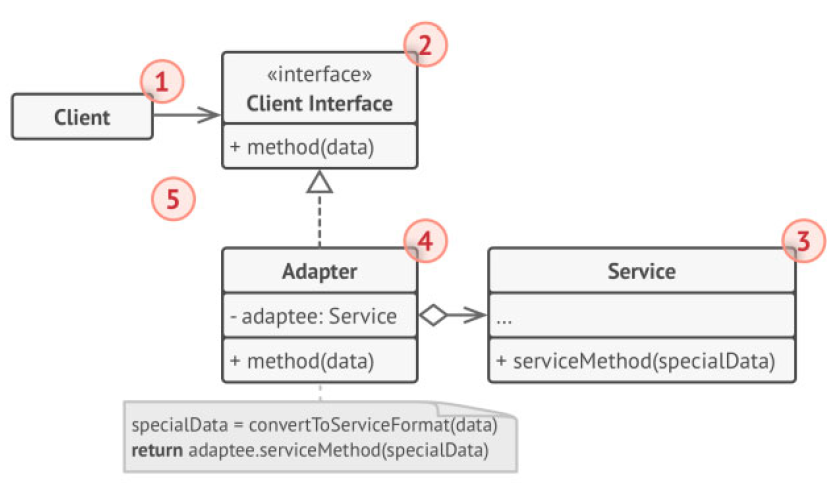

# 6. Design Patterns und mobile Anwendungen am Beispiel Android
## Softwareentwicklung mit Android
### Unterschiede zu Java
1. Progarmmiersprache
    - Android verwendet hauptsächlich Kotlin
2. Plattform
    - Android benutzt Android Software Development Kit (SDK) und spezielle Bibliotheken wie Android Jetpack
3. User Interface
    - Android verwendet XML-Dateien während Standard-Java-Anwendungen oft Swing oder JavaFX benutzten
### Aufbau eines Projektes
1. Manifest:
AndroidManifest.xml: 
    - Enthält wichtige Metadaten über die App, wie Aktivitäten, Berechtigungen und andere Komponenten.
2. Java/Kotlin Code:
    - Enthält die Geschäftslogik und Aktivitäten/Fragmente der App.
3. Ressourcen:
    - res/: Beinhaltet alle Ressourcen wie Layouts, Strings, Drawables, Styles und Menüs.
4. Gradle Build Scripts:
    - build.gradle: Konfigurationsdateien für das Build-System.
5. Assets:
    - assets/: Für rohe Asset-Dateien, die in die App eingebunden werden können.
6. Libraries:
    - libs/: Enthält externe Bibliotheken und Module.
### Beispiel für ein Composable
```Kotlin
import androidx.compose.foundation.layout.Column
import androidx.compose.material.Text
import androidx.compose.runtime.Composable
import androidx.compose.ui.tooling.preview.Preview

@Composable
fun Greeting(name: String) {
    Column {
        Text(text = "Hello, $name!")
        Text(text = "Welcome to Jetpack Compose!")
    }
}

@Preview
@Composable
fun PreviewGreeting() {
    Greeting("Android Developer")
}
```
### Einstellungen bei Projekterstellung
1. Projektname und Speicherort: 
    - Der Name und der Speicherort des Projekts.
2. Sprache: 
    - Auswahl zwischen Java und Kotlin.
3. API-Level: 
    - Auswahl des minimal unterstützten Android API-Levels.
4. Vorlagen: 
    - Auswahl einer Vorlage für die erste Aktivität (Empty Activity, Basic Activity, etc.).
5. Package Name: 
    - Ein eindeutiger Identifikator für die App, normalerweise in der Form com.beispiel.appname.
### Lifecycle von Android Projekten
1. onCreate(): 
    - Initialisierung der Aktivität. Layout wird gesetzt.
2. onStart(): 
    - Aktivität wird sichtbar.
3. onResume(): 
    - Aktivität tritt in den Vordergrund und ist interaktiv.
4. onPause(): 
    - Aktivität verliert den Vordergrundstatus, bleibt aber sichtbar.
5. onStop(): 
    - Aktivität wird unsichtbar.
6. onDestroy(): 
    - Aktivität wird zerstört.
## Design Patterns
### Singelton
- ein Entwurfsmuster, das sicherstellt, dass eine Klasse genau eine Instanz hat und bietet einen globalen Zugriffspunkt auf diese Instanz
    - z.B. für Konfigurationseinstellungen, Datenbankverbindungen
- schützt die Instanz überschrieben zu werden
- Struktur:

### Abstract Factory
- Erstellung von Familien verwandter oder abhängiger Objekte, ohne deren konkrete Klassen anzugeben

### Prototype
- erstellt Klone eines bestehenden Objektes

## Structual Patterns
### Adapter
- Der Adapter ist ein Entwurfsmuster, das es ermöglicht, Schnittstellen inkompatibler Klassen zusammenzuführen. Dieses Muster wird verwendet, wenn Klassen zusammenarbeiten sollen, deren Schnittstellen nicht zueinander passen.

### Proxy
- Der Proxy ist ein Entwurfsmuster, das einen Stellvertreter oder Platzhalter für ein anderes Objekt bereitstellt, um dessen Zugriff zu steuern.

## Behavioral Design Patterns
### Observer
- Der Observer ist ein Verhaltensmuster, das eine Eins-zu-Viele-Abhängigkeit zwischen Objekten definiert, sodass, wenn ein Objekt seinen Zustand ändert, alle abhängigen Objekte benachrichtigt und automatisch aktualisiert werden.

## Command
- Das Command-Muster ist ein Verhaltensmuster, das Objekte als Befehle kapselt und dadurch die Parameter der Empfängeraktion und die Möglichkeit der Rückgängigmachung der Aktion ermöglicht.
