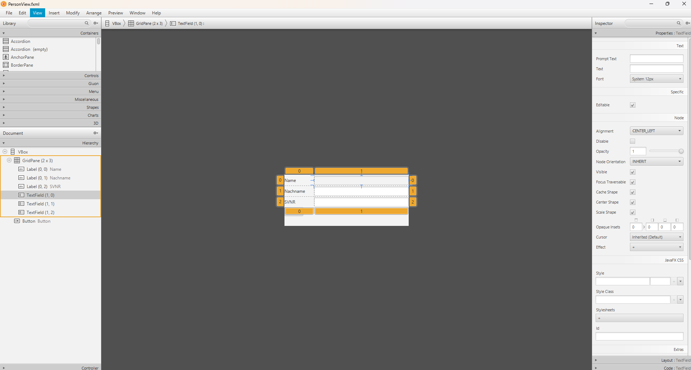
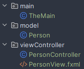
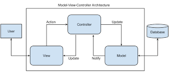

## 5. GUI-Programmierung
1. JavaFX Grundlagen, SceneBuilder, MVC
- JavaFX Grundlagen
    - Main
    ```Java
    public class TheMain extends Application {
        @Override
        public void start(Stage primaryStage) throws Exception {
            PersonController.show(primaryStage);
        }
    }
    ```
    - Model
        - repräsentiert die Daten und die Geschäftslogik der Anwendung
        - Model kennt Controller, aber nicht die View
        ```Java
        public class Person {
            private String name;
            private String surName;
            private int svnr;

            public Person(String name, String surName, int svnr) {
                this.name = name;
                this.surName = surName;
                this.svnr = svnr;
            }
        }
        ```
    - Controller
        - verarbeitung der Benutzereingaben, Anwendungslogik steuert, Interaktion zwischen Model und Ansicht koordiniert
        - Controller kennt sowohl das Model als auch die Ansicht
        ```Java
        public class PersonController {
            @FXML
            private Button btButton;

            @FXML
            private TextField tfNachname;

            @FXML
            private TextField tfName;

            @FXML
            private TextField tfSVNR;

            @FXML
            void btButtonOnAction(ActionEvent event) {
                printHello();
            }

            Person person;

            public static void show(Stage stage) {
                try {
                    FXMLLoader loader = new FXMLLoader(PersonController.class.getResource("PersonView.fxml"));
                    Parent root = loader.load();

                    Scene scene = new Scene(root);
                    stage.setScene(scene);
                    stage.setTitle("test");
                    stage.show();
                } catch (IOException e) {
                    throw new RuntimeException(e);
                }
            }

            private void printHello() {
                System.out.println("Hello");
            }
        }
        ```
    - View
        - Benutzeroberfläche der Anwendung, die dem User präsentiert wird
        - kennt das Model, aber nicht den Controller
        ```XML
        <VBox prefHeight="142.0" prefWidth="344.0" xmlns="http://javafx.com/javafx/21" xmlns:fx="http://javafx.com/fxml/1"
            fx:controller="Thema5.viewController.PersonController">

            <GridPane>
                <columnConstraints>
                    <ColumnConstraints hgrow="SOMETIMES" maxWidth="294.0" minWidth="10.0" prefWidth="82.0"/>
                    <ColumnConstraints hgrow="SOMETIMES" maxWidth="492.0" minWidth="10.0" prefWidth="262.0"/>
                </columnConstraints>
                <rowConstraints>
                    <RowConstraints minHeight="10.0" prefHeight="30.0" vgrow="SOMETIMES"/>
                    <RowConstraints minHeight="10.0" prefHeight="30.0" vgrow="SOMETIMES"/>
                    <RowConstraints minHeight="10.0" prefHeight="30.0" vgrow="SOMETIMES"/>
                </rowConstraints>
                <Label text="Name"/>
                <Label text="Nachname" GridPane.rowIndex="1"/>
                <Label text="SVNR" GridPane.rowIndex="2"/>
                <TextField fx:id="tfName" GridPane.columnIndex="1"/>
                <TextField fx:id="tfNachname" prefHeight="25.0" prefWidth="302.0" GridPane.columnIndex="1"
                        GridPane.rowIndex="1"/>
                <TextField fx:id="tfSVNR" GridPane.columnIndex="1" GridPane.rowIndex="2"/>
            </GridPane>
            <Button fx:id="btButton" mnemonicParsing="false" onAction="#btButtonOnAction" text="Button"/>
        </VBox>
        ```
- SceneBuilder
    - Graphisches Tool, das von Oracle entwickelt wurde und mit der JavaFX Plattform verwendet wird
    - UI entwerfen, ohne dirket Code schreiben müssen
<br>

- MVC
<br>



